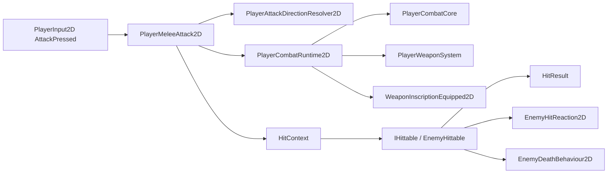
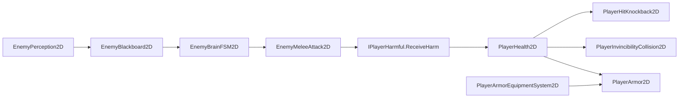
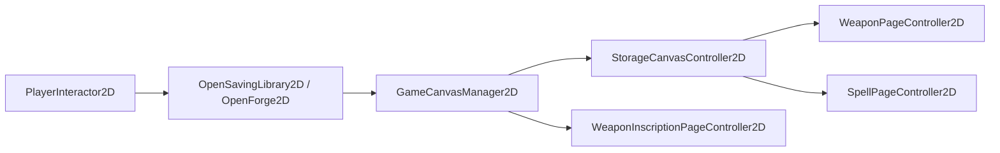

# Endless Journey Class Map

更新时间：2026-06-28  
用途：帮助新协作者理解当前代码模块、类职责和主要调用关系。功能状态请看 `../Planning/FEATURE_TRACKER.md`。

## 主要调用链

### 玩家近战打到敌人

### 敌人主动攻击玩家

### Storage / Forge UI

## Combat Shared

| Class / Type | 位置 | 职责 |
| --- | --- | --- |
| `HitContext` | `Assets/Scripts/Combat` | 一次命中的完整上下文，包含来源、伤害、类型、武器信息、hit index/count。 |
| `HitResult` | `Assets/Scripts/Combat` | 受击目标返回给攻击者的结果。 |
| `HitType` | `Assets/Scripts/Combat` | 命中来源类型。 |
| `DamageType` | `Assets/Scripts/Combat` | 伤害类型。 |
| `HittableBase` | `Assets/Scripts/Combat` | `IHittable` / `IDamageable2D` 的通用受击门禁基类。 |

## Interfaces

| Type | 职责 |
| --- | --- |
| `IHittable` | 接收 `HitContext`，返回 `HitResult`。 |
| `IDamageable2D` | 旧兼容伤害接口。 |
| `IPlayerHarmful` | 敌人对玩家造成 harm 的统一接口。 |
| `IInteractable` | 世界交互物接口。 |
| `IPickable` | 拾取物接口。 |
| `ISpellBuffReceiver2D` | Buff 法术接收接口，目前是扩展入口。 |

## Player

### Movement

| Class | 职责 |
| --- | --- |
| `PlayerCore2D` | 玩家共享运动核心，持有 Rigidbody、输入、grounded、朝向、movement/action lock。 |
| `PlayerInput2D` | 统一输入读取与键位保存/读取。 |
| `PlayerMovement2D` | 横向移动和基础跳跃。 |
| `PlayerDash2D` | 冲刺模块。 |
| `PlayerDoubleJump2D` | 二段跳模块。 |
| `GroundCheck2D` | 地面检测。 |

### Abilities / Properties

| Class | 职责 |
| --- | --- |
| `PlayerAbilityCore2D` | 能力解锁状态，从 `PlayerData.json` 同步。 |
| `PlayerHealth2D` | 生命、harm、direct health loss、受击无敌、死亡。 |
| `PlayerMana2D` | mana、potential mana、自然恢复、ManaOut、主动恢复。 |
| `PlayerArmor2D` | 盔甲耐久和减伤。 |
| `ArmorEquipped2D` | 当前装备护甲 id，写入 record.json。 |
| `PlayerArmorEquipmentSystem2D` | 将当前装备 ArmorData 应用到 `PlayerArmor2D`，并提供铁匠铺修理入口。 |
| `PlayerInvincibilityCollision2D` | 受击无敌期间临时忽略 player/enemy collision。 |

### Combat Core

| Class / Type | 职责 |
| --- | --- |
| `PlayerCombatCore` | 玩家基础战斗快照，保存 attack range、attack speed、damage per hit、hit count。 |
| `PlayerCombatRuntime2D` | 聚合当前武器、铭文、生命、法力，生成最终近战命中数据并处理动态铭文。 |
| `AttackDirection2D` | 单次近战方向。 |
| `PlayerAttackDirectionResolver2D` | 从输入和朝向解析 Forward/Up/Down。 |
| `PlayerAttackRecoil2D` | 玩家攻击 recoil。 |
| `PlayerHitKnockback2D` | 玩家受 harm 后击退和 dash 打断。 |

### Melee / Weapon

| Class | 职责 |
| --- | --- |
| `PlayerMeleeAttack2D` | 近战输入、attack window、hitbox 扫描和 `HitContext` 发送。 |
| `PlayerWeaponSystem` | 从当前武器、dual wielding、铭文计算战斗数值并写入 `PlayerCombatCore`。 |
| `WeaponEquipped2D` | 当前装备武器和 dual wielding mode，写入 record.json。 |
| `WeaponInscriptionEquipped2D` | 每把武器的铭文映射，写入 record.json。 |
| `PlayerMeleeAttackAnimator2D` | 单个攻击动画表现。 |
| `PlayerMeleeAttackAnimationController2D` | 主/副手攻击动画调度。 |

### Spell / Projectile

| Class | 职责 |
| --- | --- |
| `SpellBook2D` | 法术书页/槽位状态，读写 record.json 和 PlayerData.json。 |
| `SpellCastSystem` | 施法、吟唱、打断、消耗、冷却、cast lock 和 effect 执行。 |
| `SpellSlotCaster2D` | 从 1-5 槽位触发施法。 |
| `PlayerProjectileLauncher2D` | 生成玩家 projectile。 |
| `PlayerProjectile2D` | projectile 命中和伤害。 |
| `ProjectileMovement2D` | projectile 移动。 |

### Libraries / Save Data

| Class | 职责 |
| --- | --- |
| `WeaponLibrary2D` | 武器资产索引和解锁状态。 |
| `SpellLibrary2D` | 法术资产索引和解锁状态。 |
| `ArmorLibrary2D` | 护甲资产索引和解锁状态。 |
| `WeaponInscriptionLibrary2D` | 铭文资产索引。 |
| `PlayerRecordData2D` | record.json 数据结构。 |
| `PlayerRecordStore2D` | record.json 读写。 |
| `PlayerData2D` | PlayerData.json 数据结构。 |
| `PlayerDataStore2D` | PlayerData.json 读写。 |

### Interaction

| Class | 职责 |
| --- | --- |
| `PlayerInteractor2D` | 玩家侧交互入口，选择区域内优先级最高的 interactable。 |

## Scriptable Assets

| Class | 职责 |
| --- | --- |
| `WeaponData` | 武器静态配置。 |
| `WeaponInscriptionData` | 铭文静态配置和部分静态数值修改方法。 |
| `ArmorData` | 护甲静态配置：id、显示信息、最大耐久、减伤比例。 |
| `SpellData2D` | 法术静态配置。 |
| `SpellEffectData2D` | 法术效果基类。 |
| `DamageSpellEffectData2D` | 伤害/Projectile 法术效果。 |
| `HealSpellEffectData2D` | 治疗法术效果。 |
| `BuffSpellEffectData2D` | Buff 法术效果入口。 |

## Enemy

### Basic / Properties

| Class | 职责 |
| --- | --- |
| `EnemyCore2D` | 敌人共享核心，持有 Rigidbody、朝向、死亡状态等。 |
| `EnemyHittable` | 敌人生命、受击、死亡和 debug damage log。 |
| `EnemyHitReaction2D` | 敌人受击硬直与击退。 |
| `EnemyDeathBehaviour2D` | 敌人死亡后关闭行为、碰撞、渲染等组件。 |

### AI

| Class | 职责 |
| --- | --- |
| `EnemyBase2D` | 敌人行为基类。 |
| `EnemyBlackboard2D` | 敌人目标、可见性、状态共享记忆。 |
| `EnemyPerception2D` | 敌人索敌传感器。 |
| `EnemyBrainFSM2D` | Patrol / Chase / Attack / HitStun / Return 状态机。 |
| `EnemyPatrolWalker2D` | 地面巡逻。 |
| `EnemyFloatingWanderer2D` | 漂浮徘徊。 |
| `EnemyStabler2D` | 站桩/锁位敌人。 |

### Combat / Spawning

| Class | 职责 |
| --- | --- |
| `EnemyContactAttack2D` | 接触伤害。 |
| `EnemyContactDamageZone2D` | 子物体接触伤害转发。 |
| `EnemyMeleeAttack2D` | 主动近战攻击阶段：windup/active/recovery/cooldown。 |
| `EnemySpawner2D` | 敌人生成器。 |

## UI

### HUD

| Class | 职责 |
| --- | --- |
| `HealthDisplayer` | 生命 HUD。 |
| `ManaDisplay` | 法力 HUD。 |
| `ArmorDisplayer` | 盔甲 HUD。 |

### System UI

| Class | 职责 |
| --- | --- |
| `GameCanvasManager2D` | 顶层 UI 状态和 ESC/R 路由。 |
| `PauseMenuController2D` | Pause menu。 |
| `KeybindSettingsController2D` | 键位设置 UI。 |

### Storage

| Class / Type | 职责 |
| --- | --- |
| `StorageCanvasController2D` | Storage 内部页面管理。 |
| `WeaponPageController2D` | 武器页面操作逻辑。 |
| `WeaponPageDisplayer2D` | 武器页面显示。 |
| `WeaponPageRow2D` | 武器列表 row prefab 脚本。 |
| `WeaponPageItemViewData2D` | 武器 UI view data。 |
| `SpellPageController2D` | 法术页面操作逻辑。 |
| `SpellPageDisplayer2D` | 法术页面显示。 |
| `SpellPageSpellNameRow2D` | 法术名称 row prefab 脚本。 |
| `SpellPageSlotButton2D` | 法术页按钮 prefab 脚本。 |
| `SpellPageSpellViewData2D` | 法术 row view data。 |
| `SpellPageSlotViewData2D` | 法术页 view data。 |

### Forge

| Class / Type | 职责 |
| --- | --- |
| `WeaponInscriptionPageController2D` | Forge 铭文页面操作逻辑。 |
| `WeaponInscriptionPageDisplayer2D` | Forge 铭文页面显示。 |
| `WeaponInscriptionWeaponRow2D` | Forge 武器 row prefab 脚本。 |
| `WeaponInscriptionChoiceRow2D` | Forge 铭文 row prefab 脚本。 |
| `WeaponInscriptionWeaponViewData2D` | Forge 武器 view data。 |
| `WeaponInscriptionChoiceViewData2D` | Forge 铭文 view data。 |
| `WeaponInscriptionPageFocus2D` | Forge 当前键盘焦点枚举。 |

## Interaction / Items / Camera

| Class | 职责 |
| --- | --- |
| `TriggerInteractable2D` | 统一世界 trigger interactable 和 prompt。 |
| `OpenSavingLibrary2D` | 存档点/仓库入口。 |
| `OpenForge2D` | 铁匠铺入口，可在手动绑定 Armor equipment system 后打开时修复护甲。 |
| `ReadInteractable2D` | 阅读交互占位。 |
| `AbilityPickupItem2D` | 能力拾取物基类。 |
| `AllowDashPickup2D` | Dash 能力拾取。 |
| `AllowDoubleJumpPickup2D` | Double Jump 能力拾取。 |
| `AllowSpellCastPickup2D` | Spell Cast 能力拾取。 |
| `SimpleCameraFollow2D` | 简易相机跟随。 |

## 备注

如果新增 class，需要同步更新本文件，并在 `FEATURE_TRACKER.md` 中确认它属于哪个 Feature ID。不要按单个 class 建开发任务，除非该 class 本身就是一个独立工具。
